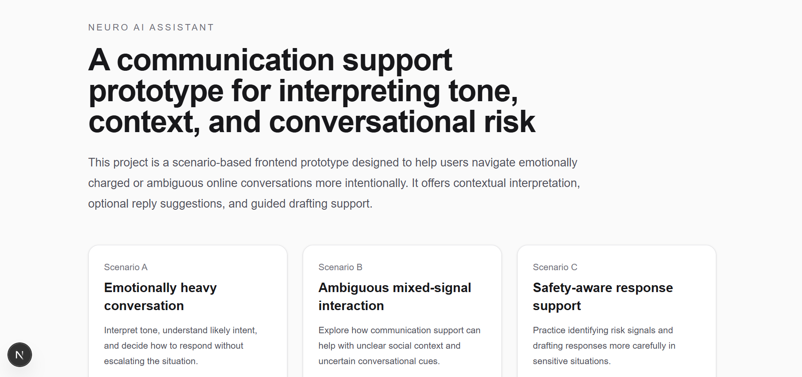

# AI Communication Assistant for Neurodivergent Users

## 🚀 Overview
An AI-powered communication support system that helps users interpret tone, intent, and conversational risks in online interactions.

## 🌐 Live Demo
[Try the prototype here](https://neuro-ai-assistant-wheat.vercel.app/)

## 🧠 Features
- Tone and intent support
- Safety-aware guidance
- Response pacing assistance
- Scenario-based interaction flows
- Real-time conversational feedback

## ⚙️ Tech Stack
- Next.js
- TypeScript
- Tailwind CSS
- React
- Lucide React

## 📸 Demo

### Home Page


### Scenario A – Assist Panel


### Scenario B


### Scenario C


## ▶️ How to Run
```bash
npm install
npm run dev